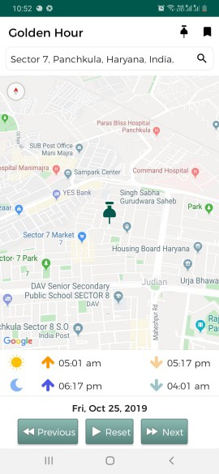
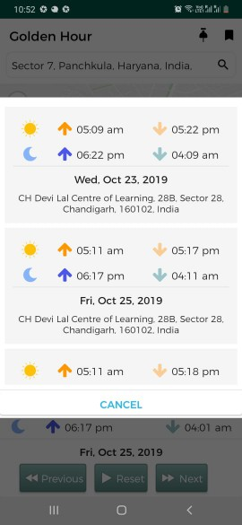
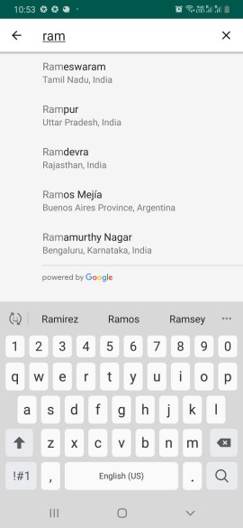

# Golden-Hour

<h1><b>Introduction:</b> </h1>
In photography, the golden hour is the period of daytime shortly after sunrise or before sunset, during which daylight is redder and softer than when the Sun is higher in the sky. The opposite period during twilight is blue hour, just before sunrise or after sunset, when indirect sunlight is evenly diffused

<h1><b>APK Link:</b> </h1> https://github.com/AndroidScooby/Golden-Hour/blob/master/app/release/golden_hour-release.apk

<h1><b>Screenshots:</b> </h1>

  

<h1><b>Programming Language:</b> </h1> Kotlin and Java

<h1><b>Android Architecture Components:</b> </h1>
<ol>
  <li>AndroidX</li>
  <li>LiveData</li>
  <li>Room</li>
  <li>Coroutines</li>
</ol> 

<h1><b>Libraries Used:</b> </h1>
<ol>
  <li>Dagger 2</li>
  <li>Rxjava 2</li>
  <li>Toasty - Custom Toast UI</li>
  <li>Google Play Services - Places SDK, Geocode, Map SDK</li>
</ol>

